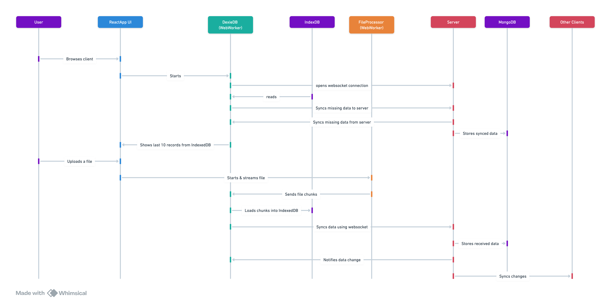

# POC - Uploading large sets of data by sharing a local cache

## Technology:
- IndexedDB as local cache & Frontend replica of the DB to show data
- MongoDB as the server DB
- [Dexie.js](https://dexie.org/), a Minimalistic Wrapper for IndexedDB
- Real-Time Data Sync: Implements [Dexie.js Syncable](https://dexie.org/docs/Syncable/Dexie.Syncable.js.html) protocol
- Adapts the ISyncProtocol for MongoDB, inspired by Dexie's example implementations ([server-side](https://github.com/dexie/Dexie.js/blob/master/samples/remote-sync/websocket/WebSocketSyncServer.js) - [client-side](https://github.com/dexie/Dexie.js/blob/master/samples/remote-sync/websocket/WebSocketSyncProtocol.js))
- Moongose library for interacting with MongoDB
- React.js for the client (CRA)
- Node.js for the server
- 2 WebWorkers, one for reading (streaming) the uploaded files, and another one for loading data into Dexie.

Diagram:
[Link](https://whimsical.com/poc-program-migrations-system-architecture-sequence-diagram-XVMMZjHBHJRwJZedgWKqso)

